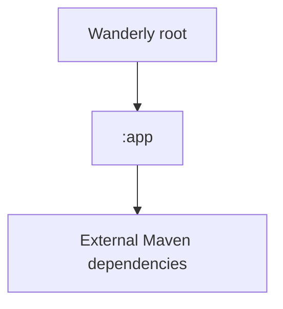
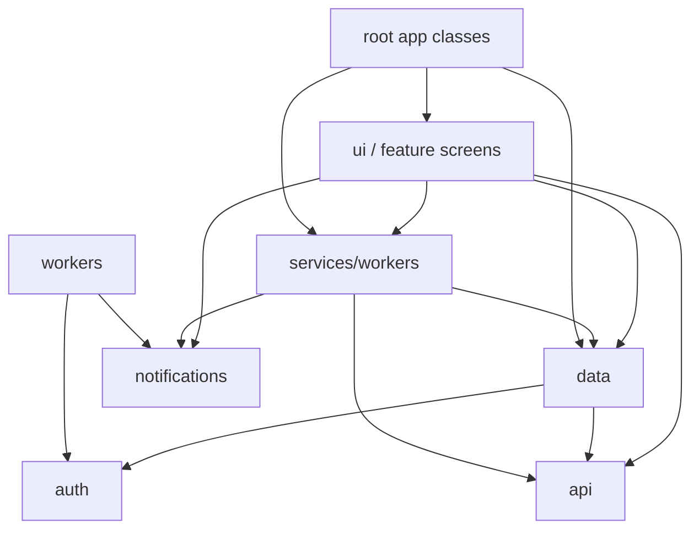

# WANDERLY - FULL PROJECT AUDIT

Generated: 2026-04-24

Context read first: `C:\Users\mihai\AndroidStudioProjects\Wanderly\context.md`

Audited working tree: current dirty working tree, including uncommitted files and generated files present under the project root at scan time.

## Scope

Recursive root scanned: `C:\Users\mihai\AndroidStudioProjects\Wanderly`

Requested extensions included with no exceptions: `.kt`, `.java`, `.xml`, `.gradle`, `.kts`, `.json`, `.properties`, `.pro`, `.yml`, `.yaml`, `.toml`.

Important distinction: the recursive scan includes generated/cache/worktree files under `.gradle`, `.idea`, `build`, `app/build`, and `.worktrees` because the request said no exceptions. Findings focus on source-owned files because generated/cache files are not actionable app source.

## Internal Index

```text
All files under root:                 12,188
Requested-extension files scanned:     1,456
Requested-extension lines scanned:   190,764
Source-owned requested files:            236
Source-owned requested lines:         15,361
Kotlin source-owned files:                96
XML source-owned files:                  131
Test source-owned files:                  28
```

Extension breakdown, full recursive requested set:

```text
.kt:          185
.java:        274
.xml:         695
.gradle:        0
.kts:           6
.json:        270
.properties:   22
.pro:           2
.yml/.yaml:     0
.toml:          2
```

Source-owned breakdown:

```text
.kt:           96 files / 10,401 lines
.xml:         131 files /  4,672 lines
.kts:           3 files /    141 lines
.properties:    4 files /     52 lines
.pro:           1 file  /     35 lines
.toml:          1 file  /     60 lines
```

## Package Structure Map

```text
com.novahorizon.wanderly                         11
com.novahorizon.wanderly.api                      6
com.novahorizon.wanderly.auth                     6
com.novahorizon.wanderly.data                    17
com.novahorizon.wanderly.invites                  4
com.novahorizon.wanderly.notifications            2
com.novahorizon.wanderly.services                 1
com.novahorizon.wanderly.streak                   2
com.novahorizon.wanderly.ui                       5
com.novahorizon.wanderly.ui.auth                  3
com.novahorizon.wanderly.ui.common                4
com.novahorizon.wanderly.ui.gems                  4
com.novahorizon.wanderly.ui.main                  1
com.novahorizon.wanderly.ui.map                   5
com.novahorizon.wanderly.ui.missions              3
com.novahorizon.wanderly.ui.onboarding            1
com.novahorizon.wanderly.ui.profile               6
com.novahorizon.wanderly.ui.social                2
com.novahorizon.wanderly.util                     4
com.novahorizon.wanderly.widgets                  7
com.novahorizon.wanderly.workers                  2
```

## Dependency Graph

Module graph:



Module cycle result: none. Only one Gradle module exists.

Package dependency graph:



Package cycle result: no hard import cycle was detected, but layering is leaky because `ui` imports `api`, `notifications`, `services`, and repository internals directly.

---

# 1. ARCHITECTURE AND CODE QUALITY

Verdict: MVVM-ish with repositories and manual dependency injection. The intent is MVVM/repository. The actual code mixes ViewModel orchestration, direct API client calls, direct repository calls from Fragments, notification triggering, and persistence reads in UI classes.

## Findings

| ID | Severity | File:line | Snippet | What actually happens | Concrete fix |
|---|---|---|---|---|---|
| MAJ-01 | MAJOR | `C:\Users\mihai\AndroidStudioProjects\Wanderly\app\src\main\java\com\novahorizon\wanderly\ui\missions\MissionsViewModel.kt:229` | `val info = GeminiClient.generateWithSearchText(` | `MissionsViewModel` directly calls the Gemini API client instead of a repository/use case. | Move place details generation behind `WanderlyRepository` or `MissionDetailsRepository`. |
| MAJ-02 | MAJOR | `C:\Users\mihai\AndroidStudioProjects\Wanderly\app\src\main\java\com\novahorizon\wanderly\ui\gems\GemsViewModel.kt:70` | `val response = GeminiClient.generateWithSearch(prompt)` | `GemsViewModel` owns AI curation and parsing, not just UI state. | Move ranking/AI parsing into `DiscoveryRepository` or `GemCurationRepository`. |
| MAJ-03 | MAJOR | `C:\Users\mihai\AndroidStudioProjects\Wanderly\app\src\main\java\com\novahorizon\wanderly\ui\map\MapFragment.kt:270` | `val repo = WanderlyGraph.repository(requireContext())` | `MapFragment` writes remote user location through the repository. | Add `MapViewModel.updateUserLocation(lat,lng)`. |
| MAJ-04 | MAJOR | `C:\Users\mihai\AndroidStudioProjects\Wanderly\app\src\main\java\com\novahorizon\wanderly\ui\map\MapFragment.kt:147` | `val repository = WanderlyGraph.repository(requireContext())` | Active mission persistence is read directly by the Fragment. | Expose active mission preview state from a ViewModel. |
| MAJ-05 | MAJOR | `C:\Users\mihai\AndroidStudioProjects\Wanderly\app\src\main\java\com\novahorizon\wanderly\ui\profile\DevDashboardFragment.kt:249` | `val rawResponse = GeminiClient.generateText(prompt)` | Admin Fragment calls AI, parses JSON, and shows notifications directly. | Move to `AdminToolsViewModel` or `NotificationPreviewUseCase`. |
| MIN-01 | MINOR | `C:\Users\mihai\AndroidStudioProjects\Wanderly\app\src\main\java\com\novahorizon\wanderly\ui\profile\ProfileViewModel.kt:64` | `repository.context.getString(R.string.profile_avatar_upload_failed)` | ViewModel resolves Android resources through repository context. | Emit resource IDs/events; resolve strings in Fragment. |
| MIN-02 | MINOR | `C:\Users\mihai\AndroidStudioProjects\Wanderly\app\src\main\java\com\novahorizon\wanderly\ui\profile\ProfileFragment.kt:464` | `when (badge) {` | Badge display logic is hardcoded inside RecyclerView adapter. | Submit `BadgeUiModel(nameRes, iconRes, backgroundRes)`. |
| MIN-03 | MINOR | `C:\Users\mihai\AndroidStudioProjects\Wanderly\app\src\main\java\com\novahorizon\wanderly\ui\missions\MissionsViewModel.kt:213` | `fun getPlaceDetails() {` | Function name says `get`, but it performs network-backed AI fetch. | Rename to `fetchPlaceDetails()` or `loadPlaceDetails()`. |

## God Classes

| Severity | File:line | Snippet | Lines | Responsibilities | Fix |
|---|---|---|---:|---|---|
| MAJOR | `C:\Users\mihai\AndroidStudioProjects\Wanderly\app\src\main\java\com\novahorizon\wanderly\notifications\NotificationCheckCoordinator.kt:15` | `object NotificationCheckCoordinator {` | 397 | streak rules, social rules, cooldown state, aggregate notification state, dedup cleanup | Split into `StreakNotificationRules`, `SocialNotificationRules`, `NotificationStateStore`. |
| MAJOR | `C:\Users\mihai\AndroidStudioProjects\Wanderly\app\src\main\java\com\novahorizon\wanderly\ui\map\MapFragment.kt:44` | `class MapFragment : Fragment() {` | 362 | permissions, OSMDroid lifecycle, current location, friend markers, active mission preview, remote location write | Extract renderer, permission controller, and ViewModel write path. |
| MAJOR | `C:\Users\mihai\AndroidStudioProjects\Wanderly\app\src\main\java\com\novahorizon\wanderly\ui\missions\MissionsFragment.kt:35` | `class MissionsFragment : Fragment() {` | 347 | location, city lookup, camera permission, photo capture, bitmap decode, state rendering, rank UI | Extract photo/location controllers. |
| MAJOR | `C:\Users\mihai\AndroidStudioProjects\Wanderly\app\src\main\java\com\novahorizon\wanderly\ui\profile\ProfileFragment.kt:43` | `class ProfileFragment : Fragment() {` | 328 before nested adapter; file is 506 | avatar pick/crop/upload, profile UI, username dialog, sharing, badges, class selection, halo styling | Move adapter/helper classes out and add presenter helpers. |
| MAJOR | `C:\Users\mihai\AndroidStudioProjects\Wanderly\app\src\main\java\com\novahorizon\wanderly\data\ProfileRepository.kt:29` | `class ProfileRepository(` | 327 | profile CRUD, rank normalization, local streak cache, avatar decode, storage upload, URL handling | Split `AvatarRepository` from profile CRUD. |
| MAJOR | `C:\Users\mihai\AndroidStudioProjects\Wanderly\app\src\main\java\com\novahorizon\wanderly\data\DiscoveryRepository.kt:20` | `class DiscoveryRepository {` | 306 | Overpass, Google Places, category mapping, filtering, ranking, distance math | Split data sources and ranker. |

## ViewModel Audit

| ViewModel | Lines | Verdict |
|---|---:|---|
| `AuthViewModel` | 84 | Reasonable size, but hardcoded auth messages should be resources. |
| `GemsViewModel` | 211 | Bloated; owns AI prompt/parsing. |
| `MainViewModel` | 139 | Reasonable but hardcoded streak messages. |
| `MissionsViewModel` | 329 | Bloated; owns prompt generation, AI parsing, place verification, streak logic, notification trigger. |
| `ProfileViewModel` | 153 | Moderate; uses repository context for strings. |
| `SocialViewModel` | 74 | Anemic/thin pass-through and missing error state. |

Repository pattern: no DAO or Retrofit is used. Room is absent. The repository boundary is still violated by direct `GeminiClient` calls from ViewModels and direct repository calls from Fragments.

Anti-pattern checklist:

```text
[x] context stored in ViewModel indirectly via repository.context
[x] hardcoded logic in RecyclerView Adapters
[ ] LiveData mutated from background threads with .value: not found
[ ] object singletons holding Activity/Fragment refs: not found
[x] runBlocking called on main-thread reachable paths
```

Code duplication >=10 lines:

| Severity | File:line | Duplicate location | Snippet | Fix |
|---|---|---|---|---|
| MINOR | `C:\Users\mihai\AndroidStudioProjects\Wanderly\app\src\main\java\com\novahorizon\wanderly\ui\gems\GemsFragment.kt:205` | `C:\Users\mihai\AndroidStudioProjects\Wanderly\app\src\main\java\com\novahorizon\wanderly\ui\map\MapFragment.kt:233`, `...\MissionsFragment.kt:279` | `private fun resolveLocationPermissionState(): LocationPermissionGate.State {` | Extract shared location permission controller. |
| MINOR | `C:\Users\mihai\AndroidStudioProjects\Wanderly\app\src\main\java\com\novahorizon\wanderly\ui\missions\MissionsViewModel.kt:315` | `C:\Users\mihai\AndroidStudioProjects\Wanderly\app\src\main\java\com\novahorizon\wanderly\ui\profile\ProfileViewModel.kt:145` | `private fun startProfileCollector() {` | Expose `currentProfile.asLiveData()` or shared collector helper. |

---

# 2. PERFORMANCE

| ID | Severity | File:line | Snippet | What actually happens | Concrete fix |
|---|---|---|---|---|---|
| MAJ-06 | MAJOR | `C:\Users\mihai\AndroidStudioProjects\Wanderly\app\src\main\java\com\novahorizon\wanderly\data\PreferencesStore.kt:244` | `return runBlocking { block() }` | DataStore reads block the calling thread. | Make preference API suspend/Flow-based. |
| MAJ-07 | MAJOR | `C:\Users\mihai\AndroidStudioProjects\Wanderly\app\src\main\java\com\novahorizon\wanderly\SplashActivity.kt:76` | `val rememberMe = PreferencesStore(this).isRememberMeEnabled()` | Splash calls the blocking wrapper from main-lifecycle coroutine. | Read in `withContext(Dispatchers.IO)` or pre-load state. |
| MAJ-08 | MAJOR | `C:\Users\mihai\AndroidStudioProjects\Wanderly\app\src\main\java\com\novahorizon\wanderly\MainActivity.kt:52` | `onboardingSeen = repository.isOnboardingSeen(),` | Main navigation setup blocks on DataStore. | Resolve startup state asynchronously before `setGraph`. |
| MAJ-09 | MAJOR | `C:\Users\mihai\AndroidStudioProjects\Wanderly\app\src\main\java\com\novahorizon\wanderly\api\GeminiClient.kt:117` | `var response = client.newCall(request).execute()` | Blocking OkHttp call is not tied to coroutine cancellation. | Use cancellable OkHttp wrapper and cancel `Call` on coroutine cancellation. |
| MAJ-10 | MAJOR | `C:\Users\mihai\AndroidStudioProjects\Wanderly\app\src\main\java\com\novahorizon\wanderly\data\DiscoveryRepository.kt:98` | `client.newCall(request).execute().use { response ->` | Overpass request can continue after screen cancellation until timeout. | Same cancellable `Call` wrapper. |
| MIN-04 | MINOR | `C:\Users\mihai\AndroidStudioProjects\Wanderly\app\src\main\java\com\novahorizon\wanderly\ui\profile\ProfileFragment.kt:77` | `val destinationFile = File.createTempFile("avatar_crop_", ".jpg", requireContext().cacheDir)` | Small file IO runs in activity-result callback on main. | Create destination off main or pre-create before launching picker. |
| MIN-05 | MINOR | `C:\Users\mihai\AndroidStudioProjects\Wanderly\app\src\main\java\com\novahorizon\wanderly\ui\common\AvatarLoader.kt:52` | `else -> Glide.with(imageView).load(trimmedSource).error(R.drawable.ic_buzzy)` | Avatar loads have `circleCrop` and cache, but no explicit size override. | Add `.override(160, 160)` or resource dimension override. |
| MIN-06 | MINOR | `C:\Users\mihai\AndroidStudioProjects\Wanderly\app\src\main\java\com\novahorizon\wanderly\ui\common\AvatarLoader.kt:148` | `return Glide.with(imageView)` | Supabase avatar fallback request also lacks explicit size. | Apply size override to primary and fallback requests. |

Coroutines/Flow:

```text
GlobalScope usage: not found
launch without lifecycle/service/viewmodel scope: not found
collect without cancellation: not found; ViewModel/service scopes are used
flowOn gaps: no CPU-heavy custom flows found
Hot flows emitting with no subscribers: no continuous hot producer found
```

Memory leak audit:

| Severity | File:line | Snippet | Finding | Fix |
|---|---|---|---|---|
| MINOR | `C:\Users\mihai\AndroidStudioProjects\Wanderly\app\src\main\java\com\novahorizon\wanderly\WanderlyGraph.kt:7` | `@Volatile` | Lint flags static repository/context. Actual repository uses `applicationContext`, but test override can hold arbitrary repository. | Keep production singleton app-context only; move overrides to test/debug DI. |

Listeners/callbacks:

```text
MapFragment map listener is unregistered at C:\Users\mihai\AndroidStudioProjects\Wanderly\app\src\main\java\com\novahorizon\wanderly\ui\map\MapFragment.kt:388
Snippet: mapListener?.let { mapView.removeMapListener(it) }
```

RecyclerView: `ListAdapter` + `DiffUtil` used. Compose/LazyColumn: N/A — Compose is not used.

Room performance: N/A — Room is not used.

Asset audit:

| Severity | File | Snippet | Finding | Fix |
|---|---|---|---|---|
| MINOR | `C:\Users\mihai\AndroidStudioProjects\Wanderly\app\src\main\res\drawable\ic_launcher_foreground.png:1` | `106.3 KB PNG in res/drawable` | Densityless bitmap over 100KB; lint also flags it. | Move to density folder or convert to WebP/vector. |
| MINOR | `C:\Users\mihai\AndroidStudioProjects\Wanderly\profile_check4.png:1` | `2,281.9 KB tracked screenshot` | Large root screenshot is tracked in git. | Move QA screenshots out of repo or document them under `docs/previews`. |

Other >100KB assets found: `profile_current.png` 470KB, `screenshot.png` 470KB, `profile_check.png` 379KB, `profile_check2.png` 376KB, `docs/previews/memory-shot-2.png` 389KB, `docs/previews/device-current.png` 198KB, `docs/previews/device-current-2.png` 111KB, `profile_after_streak.png` 102KB.

---

# 3. SECURITY

| ID | Severity | File:line | Snippet | What actually happens | Concrete fix |
|---|---|---|---|---|---|
| MAJ-11 | MAJOR | `C:\Users\mihai\AndroidStudioProjects\Wanderly\local.properties:13` | `SUPABASE_ANON_KEY=eyJhbG***` | Real-looking Supabase anon JWT exists locally. File is gitignored, but it is injected into `BuildConfig`. | Keep untracked, rotate if shared, never store service-role keys here. |
| MIN-07 | MINOR | `C:\Users\mihai\AndroidStudioProjects\Wanderly\local.properties:12` | `SUPABASE_URL=https://aimpar***.supabase.co` | Backend URL is local config, not secret, but should not be logged broadly. | Keep local and redact logs. |
| MAJ-12 | MAJOR | `C:\Users\mihai\AndroidStudioProjects\Wanderly\app\src\main\res\xml\network_security_config.xml:3` | `<base-config cleartextTrafficPermitted="false" />` | Cleartext is disabled, but no certificate pinning is configured. | Add `pin-set` if the threat model requires pinning, or document why platform trust is accepted. |
| MAJ-13 | MAJOR | `C:\Users\mihai\AndroidStudioProjects\Wanderly\app\src\main\java\com\novahorizon\wanderly\api\SupabaseClient.kt:53` | `internal fun validateConfig(supabaseUrl: String, supabaseAnonKey: String) {` | Config validation checks blank/placeholders but does not reject non-HTTPS URLs. | Parse URL and require `https`. |
| MAJ-14 | MAJOR | `C:\Users\mihai\AndroidStudioProjects\Wanderly\app\src\main\java\com\novahorizon\wanderly\api\GeminiClient.kt:22` | `private val client = OkHttpClient.Builder()` | OkHttp clients do not enforce HTTPS-only at client/interceptor level. | Use shared OkHttp client with `request.url.isHttps` interceptor. |
| MAJ-15 | MAJOR | `C:\Users\mihai\AndroidStudioProjects\Wanderly\app\src\main\java\com\novahorizon\wanderly\ui\common\AvatarLoader.kt:81` | `Log.e(TAG, "Avatar load failed for model=$model", e)` | Avatar model/path can leak in release logs. | Redact model or log only in debug. |
| MAJ-16 | MAJOR | `C:\Users\mihai\AndroidStudioProjects\Wanderly\app\src\main\java\com\novahorizon\wanderly\api\GeminiClient.kt:134` | `Log.e(TAG, "Failed to refresh session: ${refreshError.message}")` | Release log includes auth refresh exception message. | Use stable release error code; details only in debug/crash redaction. |
| MIN-08 | MINOR | `C:\Users\mihai\AndroidStudioProjects\Wanderly\app\src\main\java\com\novahorizon\wanderly\ui\common\LocationPermissionGate.kt:34` | `return context.getSharedPreferences(PREFS_NAME, Context.MODE_PRIVATE)` | Plain SharedPreferences stores only permission-request flag. Not sensitive, but inconsistent with DataStore migration. | Move to DataStore or document as non-sensitive. |
| MIN-09 | MINOR | `C:\Users\mihai\AndroidStudioProjects\Wanderly\app\proguard-rules.pro:23` | `-keep @kotlinx.serialization.Serializable class * { *; }` | Broad keep rule preserves all serializable classes. | Narrow to DTOs that need stable names. |

Secrets grep result: high-signal secret-like hits are local `SUPABASE_URL` and `SUPABASE_ANON_KEY`. The raw regex `[A-Za-z0-9]{20,}` also matches many identifiers/resource names, so only key-bearing lines are reported as secrets.

Data storage:

```text
Explicit token/password plaintext writes: not found
Supabase SDK auto-load storage: enabled at C:\Users\mihai\AndroidStudioProjects\Wanderly\app\src\main\java\com\novahorizon\wanderly\api\SupabaseClient.kt:47
Snippet: autoLoadFromStorage = true
```

WebView audit: N/A — no WebView, `javaScriptEnabled`, `setAllowFileAccess`, or `addJavascriptInterface` found in source.

Input validation:

| Field | Validation evidence |
|---|---|
| Login email | `C:\Users\mihai\AndroidStudioProjects\Wanderly\app\src\main\java\com\novahorizon\wanderly\ui\auth\LoginFragment.kt:54` - `showSnackbar(getString(R.string.auth_invalid_email), isError = true)` |
| Login password | `...\LoginFragment.kt:59` - `showSnackbar(getString(R.string.auth_password_required), isError = true)` |
| Signup email/password/confirm/username | `...\SignupFragment.kt:46`, `51`, `56`, `61` |
| Friend code | UI non-empty check at `...\SocialFragment.kt:112`; regex normalization at `C:\Users\mihai\AndroidStudioProjects\Wanderly\app\src\main\java\com\novahorizon\wanderly\data\SocialRepository.kt:143` |
| Profile username | `C:\Users\mihai\AndroidStudioProjects\Wanderly\app\src\main\java\com\novahorizon\wanderly\ui\profile\ProfileFragment.kt:326` - `if (newUsername.length >= 3) {` |
| Dev numeric fields | `C:\Users\mihai\AndroidStudioProjects\Wanderly\app\src\main\java\com\novahorizon\wanderly\ui\profile\DevDashboardFragment.kt:322` - `val editHoney = honeyInput.takeIf { it.isNotEmpty() }?.toIntOrNull()` |

SQL injection: N/A — no `rawQuery()` found and no local SQL layer exists.

Manifest exported components:

| Severity | File:line | Snippet | Finding | Fix |
|---|---|---|---|---|
| MAJOR | `C:\Users\mihai\AndroidStudioProjects\Wanderly\app\src\main\AndroidManifest.xml:45` | `android:exported="true"` | `SplashActivity` is exported for launcher/invite links. Invite parsing is regex-validated, but HTTPS App Links are not auto-verified. | Add `android:autoVerify="true"` and host `assetlinks.json`, or keep custom scheme only. |
| MAJOR | `C:\Users\mihai\AndroidStudioProjects\Wanderly\app\src\main\AndroidManifest.xml:74` | `android:exported="true"` | `AuthActivity` is exported for auth callbacks. Code validates scheme/host/path, but repo has no tests for malformed query/fragment payloads. | Add malformed callback tests and document Supabase PKCE/state validation. |
| MINOR | `C:\Users\mihai\AndroidStudioProjects\Wanderly\app\src\main\AndroidManifest.xml:95` | `android:exported="true"` | Widget receiver is exported, expected for app widgets, no custom permission. | Keep exported but validate custom actions in `onReceive`. |

---

# 4. CRASH RISKS AND STABILITY

`.\gradlew.bat :app:lintDebug --console=plain` failed with 5 errors and 138 warnings.

## Critical Lint Errors

| ID | Severity | File:line | Snippet | Actual risk | Concrete fix |
|---|---|---|---|---|---|
| CRIT-01 | CRITICAL | `C:\Users\mihai\AndroidStudioProjects\Wanderly\app\src\main\java\com\novahorizon\wanderly\WanderlyServices.kt:89` | `fusedLocationClient.getCurrentLocation(Priority.PRIORITY_HIGH_ACCURACY, null)` | Missing permission check can throw `SecurityException`. | Check fine/coarse permission immediately before call and catch `SecurityException`. |
| CRIT-02 | CRITICAL | `C:\Users\mihai\AndroidStudioProjects\Wanderly\app\src\main\AndroidManifest.xml:6` | `<uses-permission android:name="android.permission.ACCESS_FINE_LOCATION" />` | Fine location without coarse violates Android 12+ lint rule. | Add `ACCESS_COARSE_LOCATION` and handle approximate grant. |
| CRIT-03 | CRITICAL | `C:\Users\mihai\AndroidStudioProjects\Wanderly\app\src\main\java\com\novahorizon\wanderly\widgets\StreakWidgetAlarmScheduler.kt:48` | `alarmManager.canScheduleExactAlarms()` | API 31 call not lint-provably guarded for minSdk 26. | Use direct `Build.VERSION.SDK_INT >= S` guard or `@RequiresApi` helper. |
| CRIT-04 | CRITICAL | `C:\Users\mihai\AndroidStudioProjects\Wanderly\app\src\main\res\layout\item_onboarding_page.xml:71` | `android:tint="@color/text_primary" />` | AppCompat lint error; build fails under lint. | Replace with `app:tint`. |
| CRIT-05 | CRITICAL | `C:\Users\mihai\AndroidStudioProjects\Wanderly\app\src\main\res\layout\item_social_profile.xml:131` | `android:tint="@color/error"` | AppCompat lint error; build fails under lint. | Replace with `app:tint`. |

## Exception Handling

| Severity | File:line | Snippet | Finding | Fix |
|---|---|---|---|---|
| MINOR | `C:\Users\mihai\AndroidStudioProjects\Wanderly\app\src\main\java\com\novahorizon\wanderly\data\ProfileRepository.kt:134` | `} catch (_: Exception) {` | Test helper swallows exception and returns false. | Log debug or return failure reason. |
| MINOR | `C:\Users\mihai\AndroidStudioProjects\Wanderly\app\src\main\java\com\novahorizon\wanderly\widgets\WanderlyStreakWidgetProvider.kt:103` | `} catch (_: Exception) {` | Widget fetch failure is swallowed to null. | Add redacted debug/telemetry log. |

## Null Safety

All `!!` occurrences:

```text
SAFE-ish binding getter: C:\Users\mihai\AndroidStudioProjects\Wanderly\app\src\main\java\com\novahorizon\wanderly\ui\auth\LoginFragment.kt:26 - private val binding get() = _binding!!
SAFE-ish binding getter: C:\Users\mihai\AndroidStudioProjects\Wanderly\app\src\main\java\com\novahorizon\wanderly\ui\auth\SignupFragment.kt:20 - private val binding get() = _binding!!
RISKY after onDestroyView: C:\Users\mihai\AndroidStudioProjects\Wanderly\app\src\main\java\com\novahorizon\wanderly\ui\map\MapFragment.kt:47 - private val binding get() = _binding!!
RISKY after onDestroyView: C:\Users\mihai\AndroidStudioProjects\Wanderly\app\src\main\java\com\novahorizon\wanderly\ui\missions\MissionsFragment.kt:38 - private val binding get() = _binding!!
SAFE-ish binding getter: C:\Users\mihai\AndroidStudioProjects\Wanderly\app\src\main\java\com\novahorizon\wanderly\ui\onboarding\OnboardingFragment.kt:23 - private val binding get() = _binding!!
RISKY async callback: C:\Users\mihai\AndroidStudioProjects\Wanderly\app\src\main\java\com\novahorizon\wanderly\ui\profile\DevDashboardFragment.kt:35 - private val binding get() = _binding!!
RISKY activity result callback: C:\Users\mihai\AndroidStudioProjects\Wanderly\app\src\main\java\com\novahorizon\wanderly\ui\profile\ProfileFragment.kt:46 - private val binding get() = _binding!!
SAFE test fixture: C:\Users\mihai\AndroidStudioProjects\Wanderly\app\src\test\java\com\novahorizon\wanderly\util\DateUtilsTest.kt:17 - val localLateNight = parser.parse("2026-04-22 01:30")!!
```

Fix for risky binding getters: use `_binding ?: return` inside async callbacks and keep work tied to `viewLifecycleOwner`.

Lifecycle:

```text
Map listener unregister: C:\Users\mihai\AndroidStudioProjects\Wanderly\app\src\main\java\com\novahorizon\wanderly\ui\map\MapFragment.kt:388
Snippet: mapListener?.let { mapView.removeMapListener(it) }
Fragment transactions: N/A — no direct commit() calls found.
```

Crash-prone patterns:

| Severity | File:line | Snippet | Finding | Fix |
|---|---|---|---|---|
| MINOR | `C:\Users\mihai\AndroidStudioProjects\Wanderly\app\src\main\java\com\novahorizon\wanderly\ui\map\FriendMapClusterer.kt:56` | `return 156543.03392 * cos(clampedLatitude * PI / 180.0) / (1 shl zoomLevel.toInt())` | Shift assumes safe zoom integer range. | `zoomLevel.toInt().coerceIn(0, 22)`. |

`indexOf()` check: safe in `DevDashboardFragment` because lines 250-253 check `-1` before substring.

---

# 5. NETWORK AND API

Retrofit: N/A — no Retrofit dependency or annotations.

Ktor: present as Supabase engine. Direct app calls use OkHttp.

Client timeouts:

```text
GeminiClient: connect 60s, read 120s, write 60s - C:\Users\mihai\AndroidStudioProjects\Wanderly\app\src\main\java\com\novahorizon\wanderly\api\GeminiClient.kt:23
PlacesProxyClient: connect/read/write 30s - C:\Users\mihai\AndroidStudioProjects\Wanderly\app\src\main\java\com\novahorizon\wanderly\api\PlacesProxyClient.kt:17
DiscoveryRepository: connect/read/write 30s - C:\Users\mihai\AndroidStudioProjects\Wanderly\app\src\main\java\com\novahorizon\wanderly\data\DiscoveryRepository.kt:22
ProfileRepository: connect/read/write 30s - C:\Users\mihai\AndroidStudioProjects\Wanderly\app\src\main\java\com\novahorizon\wanderly\data\ProfileRepository.kt:59
```

| ID | Severity | File:line | Snippet | Finding | Fix |
|---|---|---|---|---|---|
| MAJ-17 | MAJOR | `C:\Users\mihai\AndroidStudioProjects\Wanderly\app\src\main\java\com\novahorizon\wanderly\api\PlacesProxyClient.kt:62` | `if (!resp.isSuccessful) {` | 4xx/5xx/timeouts/parse failures collapse into generic exceptions. | Return sealed `NetworkResult`. |
| MAJ-18 | MAJOR | `C:\Users\mihai\AndroidStudioProjects\Wanderly\app\src\main\java\com\novahorizon\wanderly\api\GeminiClient.kt:144` | `throw Exception("Proxy call failed: ${resp.code}")` | Only 401 is retried; no exponential backoff for 429/5xx/timeouts. | Add bounded backoff with jitter. |
| MAJ-19 | MAJOR | `C:\Users\mihai\AndroidStudioProjects\Wanderly\app\src\main\java\com\novahorizon\wanderly\ui\missions\MissionsViewModel.kt:208` | `_missionState.postValue(MissionState.Error("System error: ${e.message}"))` | Raw exception message can reach users. | Map errors to string resources; log internals separately. |
| MAJ-20 | MAJOR | `C:\Users\mihai\AndroidStudioProjects\Wanderly\app\src\main\java\com\novahorizon\wanderly\ui\social\SocialViewModel.kt:19` | `private val _isLoading = MutableLiveData<Boolean>(false)` | Social state is scattered booleans/nullables, not a single state machine. | Use `SocialUiState.Loading/Loaded/Empty/Error`. |
| MIN-10 | MINOR | `C:\Users\mihai\AndroidStudioProjects\Wanderly\app\src\main\java\com\novahorizon\wanderly\ui\gems\GemsLoadGate.kt:4` | `internal fun shouldAutoLoad(currentState: GemsViewModel.GemsState?): Boolean {` | Only auto-load is gated; manual refresh has no throttle. | Add per-location cooldown/debounce. |

Caching/offline:

```text
Cache-Control: not implemented for direct OkHttp calls.
Offline-first: not implemented.
Pagination: no Paging 3; most lists are bounded by friend count or take(40)/take(12).
Logging interceptor: not found.
```

---

# 6. DATABASE AND LOCAL STORAGE

Room/SQLite: N/A — no Room dependency, `@Database`, `@Entity`, `@Dao`, or `@Query`.

Remote DB: Supabase tables are inferred from code (`profiles`, `friendships`). No SQL migrations or schema files are present.

| ID | Severity | File:line | Snippet | Finding | Fix |
|---|---|---|---|---|---|
| MAJ-21 | MAJOR | `C:\Users\mihai\AndroidStudioProjects\Wanderly\app\src\main\java\com\novahorizon\wanderly\data\SocialRepository.kt:57` | `.select { filter { eq("friend_code", normalizedCode) } }` | No committed migration proves `profiles.friend_code` is unique/indexed. | Add Supabase migration with unique index. |
| MAJ-22 | MAJOR | `C:\Users\mihai\AndroidStudioProjects\Wanderly\app\src\main\java\com\novahorizon\wanderly\data\SocialRepository.kt:18` | `val friendships = SupabaseClient.client.postgrest["friendships"]` | Queries filter by `user_id` OR `friend_id`; no committed indexes prove this is efficient. | Add indexes on `friendships(user_id)` and `friendships(friend_id)`. |
| MIN-11 | MINOR | `C:\Users\mihai\AndroidStudioProjects\Wanderly\app\src\main\java\com\novahorizon\wanderly\data\PreferencesStore.kt:149` | `fun removeNotificationCooldown(key: String) = blockingWrite {` | Cooldown state has clear/remove APIs but no age-based cleanup. | Prune stale notification keys periodically. |

Transactions: N/A for local DB. Remote multi-step operations are not transactionally wrapped in client code.

Large objects: no local DB BLOBs. Avatars go to Supabase Storage.

TypeConverters/WAL: N/A — Room is not used.

---

# 7. UI AND USER EXPERIENCE

| ID | Severity | File:line | Snippet | Finding | Fix |
|---|---|---|---|---|---|
| MAJ-23 | MAJOR | `C:\Users\mihai\AndroidStudioProjects\Wanderly\app\src\main\java\com\novahorizon\wanderly\ui\missions\MissionsViewModel.kt:29` | `class MissionsViewModel(private val repository: WanderlyRepository) : ViewModel() {` | No `SavedStateHandle`; transient mission verification/details/loading state can be lost on process death. | Add `SavedStateHandle` for multi-step state. |
| MAJ-24 | MAJOR | `C:\Users\mihai\AndroidStudioProjects\Wanderly\app\src\main\res\layout\fragment_profile.xml:174` | `<ImageButton` | Share friend-code touch target is 40dp x 40dp. | Make it 48dp or wrap in 48dp touch container. |
| MAJ-25 | MAJOR | `C:\Users\mihai\AndroidStudioProjects\Wanderly\app\src\main\java\com\novahorizon\wanderly\ui\profile\ProfileViewModel.kt:38` | `fun loadProfile() {` | Profile load silently returns if profile is null; no loading/error state. | Expose `ProfileUiState.Loading/Loaded/Error`. |
| MAJ-26 | MAJOR | `C:\Users\mihai\AndroidStudioProjects\Wanderly\app\src\main\res\layout\activity_splash.xml:15` | `<ImageView` | Missing `contentDescription` or decorative accessibility flag. | Add content description or `importantForAccessibility="no"`. |
| MAJ-27 | MAJOR | `C:\Users\mihai\AndroidStudioProjects\Wanderly\app\src\main\res\layout\item_social_profile.xml:57` | `<ImageView` | Social avatar image lacks accessibility description. | Bind username description or mark decorative. |
| MIN-12 | MINOR | `C:\Users\mihai\AndroidStudioProjects\Wanderly\app\src\main\res\values\colors.xml:4` | `<color name="primary">#F5A623</color>` | Primary color is used as text in multiple layouts and has weak contrast on light backgrounds. | Add darker `primary_text` color. |
| MIN-13 | MINOR | `C:\Users\mihai\AndroidStudioProjects\Wanderly\app\src\main\res\values\colors.xml:6` | `<color name="accent">#FFD166</color>` | Accent text use is low contrast on light backgrounds. | Use dark text over accent or darker accent variant. |
| MIN-14 | MINOR | `C:\Users\mihai\AndroidStudioProjects\Wanderly\app\src\main\res\layout\fragment_social.xml:118` | `<com.google.android.material.textfield.TextInputEditText` | Friend-code input lacks `imeOptions`. | Add `actionDone` and editor action. |
| MIN-15 | MINOR | `C:\Users\mihai\AndroidStudioProjects\Wanderly\app\src\main\res\layout\fragment_dev_dashboard.xml:126` | `<EditText` | Lint flags missing `inputType`. | Add `inputType` or mark not autofillable. |
| MIN-16 | MINOR | `C:\Users\mihai\AndroidStudioProjects\Wanderly\app\src\main\java\com\novahorizon\wanderly\ui\social\SocialFragment.kt:228` | `holder.rankNumber.text = "#${position + 1}"` | Hardcoded/interpolated UI string. | Use string resource placeholder. |
| MIN-17 | MINOR | `C:\Users\mihai\AndroidStudioProjects\Wanderly\app\src\main\res\menu\bottom_nav_menu_dev.xml:22` | `android:title="God Mode" />` | Hardcoded menu title. | Extract to `strings.xml`. |

Keyboard handling: `AuthActivity` uses `windowSoftInputMode="adjustResize"` at manifest line 74. Login/signup fields have IME actions. Social/dev fields need polish as above.

Back navigation: Navigation Component handles normal back stack. No custom `OnBackPressedCallback` found.

Edge-to-edge: present in `MainActivity`:

```text
C:\Users\mihai\AndroidStudioProjects\Wanderly\app\src\main\java\com\novahorizon\wanderly\MainActivity.kt:103
Snippet: ViewCompat.setOnApplyWindowInsetsListener(binding.root) { _, insets ->
```

Compose recomposition: N/A — Compose is not used.

---

# 8. DEPENDENCIES AND BUILD

Verification:

```text
.\gradlew.bat :app:testDebugUnitTest --stacktrace
Result: PASS, 98 tests, 0 failures, 0 errors

.\gradlew.bat :app:dependencies --configuration debugRuntimeClasspath
Result: PASS, no FAILED resolution lines found

.\gradlew.bat :app:lintDebug --console=plain
Result: FAIL, 5 errors, 138 warnings
```

OSS Index check: attempted `https://ossindex.sonatype.org/api/v3/component-report`; response was `401 Unauthorized` without credentials. OSV fallback query returned 28 dependency results and no direct vulnerabilities for declared direct dependencies.

Reference links used: [OSS Index REST API](https://ossindex.sonatype.org/doc/rest), [OSS Index coordinates](https://ossindex.sonatype.org/doc/coordinates), [Maven Central OkHttp](https://repo.maven.apache.org/maven2/com/squareup/okhttp3/okhttp/), [Maven Central kotlinx serialization](https://repo1.maven.org/maven2/org/jetbrains/kotlinx/kotlinx-serialization-json-io-jvm/).

Outdated dependencies reported by lint:

| Severity | File:line | Snippet | Latest reported | Fix |
|---|---|---|---|---|
| MAJOR | `C:\Users\mihai\AndroidStudioProjects\Wanderly\gradle\libs.versions.toml:2` | `agp = "9.1.0"` | 9.2.0 | Upgrade AGP after Gradle/Studio compatibility check. |
| MAJOR | `C:\Users\mihai\AndroidStudioProjects\Wanderly\gradle\libs.versions.toml:3` | `kotlin = "2.2.10"` | 2.3.21 | Upgrade Kotlin plugins together. |
| MINOR | `C:\Users\mihai\AndroidStudioProjects\Wanderly\gradle\libs.versions.toml:13` | `serialization = "1.7.3"` | 1.11.0 | Upgrade with Kotlin alignment. |
| MINOR | `C:\Users\mihai\AndroidStudioProjects\Wanderly\gradle\libs.versions.toml:14` | `coroutines = "1.9.0"` | 1.10.2 | Upgrade and run coroutine tests. |
| MINOR | `C:\Users\mihai\AndroidStudioProjects\Wanderly\gradle\libs.versions.toml:17` | `glide = "4.16.0"` | 5.0.7 | Evaluate Glide 5 migration. |
| MINOR | `C:\Users\mihai\AndroidStudioProjects\Wanderly\gradle\libs.versions.toml:18` | `osmdroid = "6.1.18"` | 6.1.20 | Upgrade and smoke test map. |
| MINOR | `C:\Users\mihai\AndroidStudioProjects\Wanderly\gradle\libs.versions.toml:21` | `ktor = "3.0.1"` | 3.4.3 | Verify Supabase compatibility. |
| MINOR | `C:\Users\mihai\AndroidStudioProjects\Wanderly\gradle\libs.versions.toml:23` | `okhttp = "4.12.0"` | 5.3.2 | Plan OkHttp 5 migration. |
| MINOR | `C:\Users\mihai\AndroidStudioProjects\Wanderly\gradle\libs.versions.toml:24` | `work = "2.10.4"` | 2.11.2 | Upgrade and test widget/workers. |

Other lint-reported updates: Material 1.13.0, ConstraintLayout 2.2.1, Navigation 2.9.8, DataStore 1.2.1, AndroidX test JUnit 1.3.0, Espresso 3.7.0.

Version conflicts/drift:

| Severity | File:line | Snippet | Finding | Fix |
|---|---|---|---|---|
| MAJOR | `C:\Users\mihai\AndroidStudioProjects\Wanderly\gradle\libs.versions.toml:3` | `kotlin = "2.2.10"` | Dependency tree upgrades Kotlin stdlib transitively to 2.3.20 while plugin catalog is 2.2.10. | Align Kotlin plugin/stdlib/kotlinx versions. |

SDK levels:

```text
C:\Users\mihai\AndroidStudioProjects\Wanderly\app\build.gradle.kts:14 - compileSdk = 36
C:\Users\mihai\AndroidStudioProjects\Wanderly\app\build.gradle.kts:17 - minSdk = 26
C:\Users\mihai\AndroidStudioProjects\Wanderly\app\build.gradle.kts:18 - targetSdk = 36
```

Release R8:

```text
C:\Users\mihai\AndroidStudioProjects\Wanderly\app\build.gradle.kts:36 - isMinifyEnabled = true
C:\Users\mihai\AndroidStudioProjects\Wanderly\app\build.gradle.kts:37 - isShrinkResources = true
```

Build findings:

| Severity | File:line | Snippet | Finding | Fix |
|---|---|---|---|---|
| MAJOR | `C:\Users\mihai\AndroidStudioProjects\Wanderly\gradle.properties:18` | `android.builtInKotlin=false` | Deprecated; AGP says removal in 10.0. | Remove and validate build. |
| MAJOR | `C:\Users\mihai\AndroidStudioProjects\Wanderly\gradle.properties:19` | `android.newDsl=false` | Deprecated; AGP says removal in 10.0. | Remove and update scripts if needed. |
| MINOR | `C:\Users\mihai\AndroidStudioProjects\Wanderly\app\build.gradle.kts:91` | `kapt(libs.glide.compiler)` | Lint recommends KSP for supported processors. | Move Glide compiler to KSP after compatibility check. |

Unused dependencies: no direct declared dependency with zero source references was confidently identified.

Debug-only tools: LeakCanary/Flipper/Chucker not found. OkHttp logging interceptor not found.

Build variants: debug/release only. N/A — no staging flavor exists to audit.

---

# 9. TESTING

Test classes found:

```text
androidTest: ExampleInstrumentedTest, LoginFlowInstrumentedTest, MissionGenerationInstrumentedTest
unit: PlacesGeocoderNameMatchTest, SupabaseClientConfigTest, AuthCallbackMatcherTest, AuthRoutingTest, HiveRankTest,
      ProfileRepositoryAvatarStorageTargetTest, ProfileRepositoryPayloadTest, SocialRepositoryFriendCodeTest,
      InviteDeepLinkTest, InviteShareFormatterTest, DailyStreakStatusEvaluatorTest, AvatarLoaderUrlPolicyTest,
      GemsLoadGateTest, LocationPermissionGateTest, MainNavigationDestinationsTest, FriendMapClustererTest,
      MapLocationCallbackGuardTest, ProfileFragmentAvatarPresentationTest, AiResponseParserTest, DateUtilsTest,
      StreakTierHelperTest, StreakWidgetAlarmSchedulerTest, StreakWidgetStateHelperTest
```

| Severity | File:line | Snippet | Finding | Fix |
|---|---|---|---|---|
| MAJOR | `C:\Users\mihai\AndroidStudioProjects\Wanderly\app\src\test\java\com\novahorizon\wanderly\ui\map\FriendMapClustererTest.kt:1` | `package com.novahorizon.wanderly.ui.map` | Good map unit coverage exists, but equivalent ViewModel/network error coverage is missing. | Add tests for Missions/Gems/Social/Profile ViewModels with fake repositories/API clients. |
| MAJOR | `C:\Users\mihai\AndroidStudioProjects\Wanderly\app\src\androidTest\java\com\novahorizon\wanderly\MissionGenerationInstrumentedTest.kt:71` | `Intents.init()` | Instrumented tests exist but were not run by unit-test command. | Add CI/emulator step for `connectedDebugAndroidTest`. |

Coverage estimate: no JaCoCo/Kover report. Static estimate is about 25% of critical behavior, lower for network/UI error states.

Critical uncovered flows:

```text
1. Supabase auth offline/failure login
2. Gemini/Places token refresh failure
3. HTTP 429/5xx retry UX
4. Avatar upload failures and large image memory path
5. Social add/remove friend failures
6. Streak crisis restore/reset UI
7. Location permanently-denied flow
8. Notification permission denied/permanently denied
9. Exact alarm behavior by API level
10. Malformed auth/invite deep links
```

Thread.sleep usage: not found. MockK/Mockito: not used; manual fakes are used.

---

# 10. PERMISSIONS

Declared permissions:

```text
C:\Users\mihai\AndroidStudioProjects\Wanderly\app\src\main\AndroidManifest.xml:5  INTERNET
C:\Users\mihai\AndroidStudioProjects\Wanderly\app\src\main\AndroidManifest.xml:6  ACCESS_FINE_LOCATION
C:\Users\mihai\AndroidStudioProjects\Wanderly\app\src\main\AndroidManifest.xml:7  CAMERA
C:\Users\mihai\AndroidStudioProjects\Wanderly\app\src\main\AndroidManifest.xml:8  POST_NOTIFICATIONS
C:\Users\mihai\AndroidStudioProjects\Wanderly\app\src\main\AndroidManifest.xml:9  FOREGROUND_SERVICE
C:\Users\mihai\AndroidStudioProjects\Wanderly\app\src\main\AndroidManifest.xml:10 FOREGROUND_SERVICE_DATA_SYNC
C:\Users\mihai\AndroidStudioProjects\Wanderly\app\src\main\AndroidManifest.xml:11 SCHEDULE_EXACT_ALARM
```

| ID | Severity | File:line | Snippet | Finding | Fix |
|---|---|---|---|---|---|
| CRIT-06 | CRITICAL | `C:\Users\mihai\AndroidStudioProjects\Wanderly\app\src\main\AndroidManifest.xml:6` | `<uses-permission android:name="android.permission.ACCESS_FINE_LOCATION" />` | `ACCESS_COARSE_LOCATION` missing. | Add coarse permission and support approximate grants. |
| MAJ-28 | MAJOR | `C:\Users\mihai\AndroidStudioProjects\Wanderly\app\src\main\java\com\novahorizon\wanderly\MainActivity.kt:153` | `ActivityCompat.requestPermissions(this, arrayOf(Manifest.permission.POST_NOTIFICATIONS), 101)` | Notification permission requested at main startup with no rationale/fallback handling. | Ask at point of value and handle denial/permanent denial. |
| MAJ-29 | MAJOR | `C:\Users\mihai\AndroidStudioProjects\Wanderly\app\src\main\AndroidManifest.xml:11` | `<uses-permission android:name="android.permission.SCHEDULE_EXACT_ALARM" />` | Exact alarm permission declared, but no settings request flow was found. | Add `ACTION_REQUEST_SCHEDULE_EXACT_ALARM` flow or remove permission and use inexact alarms. |

Unused permissions: no fully orphaned dangerous permission was confirmed. `SCHEDULE_EXACT_ALARM` is used conceptually but lacks runtime/user-management flow.

Android 13 media permissions: N/A — `READ_EXTERNAL_STORAGE` not found.

Background location: N/A — `ACCESS_BACKGROUND_LOCATION` not found.

---

# 11. MANIFEST AND CONFIGURATION

| ID | Severity | File:line | Snippet | Finding | Fix |
|---|---|---|---|---|---|
| MIN-18 | MINOR | `C:\Users\mihai\AndroidStudioProjects\Wanderly\app\src\main\AndroidManifest.xml:57` | `<data android:scheme="wanderly" android:host="invite" />` | Lint warns data tags combine in non-obvious ways. | Split intent filters for each link shape. |
| MAJ-30 | MAJOR | `C:\Users\mihai\AndroidStudioProjects\Wanderly\app\src\main\AndroidManifest.xml:19` | `android:allowBackup="false"` | Lint warns this is deprecated on Android 12+ without `dataExtractionRules`. | Add `android:dataExtractionRules="@xml/data_extraction_rules"` or remove sample rules. |
| MAJ-31 | MAJOR | `C:\Users\mihai\AndroidStudioProjects\Wanderly\app\src\main\res\xml\data_extraction_rules.xml:3` | `<cloud-backup />` | Sample extraction rules allow backup/transfer and are unused. | Customize exclusions and reference from manifest, or delete. |
| MIN-19 | MINOR | `C:\Users\mihai\AndroidStudioProjects\Wanderly\app\src\main\res\xml\file_paths.xml:3` | `<cache-path name="my_images" path="." />` | FileProvider exposes whole cache directory under grants. | Scope to `images/` subdirectory. |

Component declarations: all Activities/Service/Receiver/Provider used by source are declared.

Launch modes: no `singleTask` or `singleInstance`.

`android:debuggable="true"`: not found.

Deep/App links: no `autoVerify="true"` found for HTTPS links.

---

# 12. LOGGING AND DEBUGGING

Static scan found 62 `Log.*`/print occurrences in source-owned files.

| ID | Severity | File:line | Snippet | Finding | Fix |
|---|---|---|---|---|---|
| MAJ-32 | MAJOR | `C:\Users\mihai\AndroidStudioProjects\Wanderly\app\src\main\java\com\novahorizon\wanderly\api\PlacesGeocoder.kt:56` | `Log.d("PlacesGeocoder", "--- Starting search: '$placeName' in '$targetCity' ---")` | Production log can expose place/city search context. | Guard with `BuildConfig.DEBUG` or redact. |
| MAJ-33 | MAJOR | `C:\Users\mihai\AndroidStudioProjects\Wanderly\app\src\main\java\com\novahorizon\wanderly\api\PlacesGeocoder.kt:139` | `Log.e("PlacesGeocoder", "Failed to resolve '$placeName' with Google Places", e)` | Failure log includes searched place name. | Redact place name in release logs. |
| MAJ-34 | MAJOR | `C:\Users\mihai\AndroidStudioProjects\Wanderly\app\src\main\java\com\novahorizon\wanderly\data\DiscoveryRepository.kt:243` | `Log.e("DiscoveryRepository", "Google Places fallback error for query '$query': ${e.message}")` | Logs raw Google Places query and error message. | Log query type/status only. |
| MAJ-35 | MAJOR | `C:\Users\mihai\AndroidStudioProjects\Wanderly\app\src\main\java\com\novahorizon\wanderly\api\SupabaseClient.kt:27` | `Log.d(TAG, "Initializing Supabase with URL: ${BuildConfig.SUPABASE_URL}")` | Debug log prints backend URL. | Redact project ref/host; keep only debug. |
| MIN-20 | MINOR | `C:\Users\mihai\AndroidStudioProjects\Wanderly\app\src\main\java\com\novahorizon\wanderly\data\PreferencesStore.kt:243` | `// TODO: Replace remaining synchronous preference callers so DataStore reads stay fully non-blocking.` | Known performance TODO remains. | Finish async preference migration. |
| MIN-21 | MINOR | `C:\Users\mihai\AndroidStudioProjects\Wanderly\app\src\main\res\xml\backup_rules.xml:2` | `Sample backup rules file; uncomment and customize as necessary.` | Sample backup file is unused/noisy. | Customize or remove. |

Timber: not used. Crash reporting release tree/service: not found.

Commented-out code blocks >5 runtime lines: no significant runtime block found; sample XML comments should be cleaned.

---

# 13. CI/CD AND PROJECT HYGIENE

CI: N/A — no `.github/`, Bitrise, CircleCI, GitLab CI, or Azure pipeline file found.

Lint baseline: N/A — no lint baseline or `lint.xml` found. Current lint fails; baseline should not be added before fixing the 5 errors.

Pre-commit hooks: N/A — no `.pre-commit-config.yaml`, ktlint, or detekt config found.

CHANGELOG: N/A — no `CHANGELOG.md` found.

Keystore/google-services: no `.jks`, `.keystore`, or `google-services.json` found.

| ID | Severity | File:line | Snippet | Finding | Fix |
|---|---|---|---|---|---|
| MAJ-36 | MAJOR | `C:\Users\mihai\AndroidStudioProjects\Wanderly\app\build.gradle.kts:36` | `isMinifyEnabled = true` | Release build is configured, but no CI enforces tests/lint/release assemble. | Add CI running unit tests, lint, and release assemble. |
| MIN-22 | MINOR | `C:\Users\mihai\AndroidStudioProjects\Wanderly\.gitignore:20` | `local.properties` | `local.properties` is ignored twice. | Remove duplicate ignore entry. |

`.gitignore` correctly ignores `/local.properties`, `.gradle`, `.kotlin`, `.worktrees`, and Supabase temp files.

---

# AUDIT SUMMARY

## Scan Statistics

```text
Files scanned:        1,456 requested-extension files
Total files under root: 12,188
Total lines of code:  190,764 requested-extension lines including generated/cache files
Source-owned LOC:      15,361
Kotlin files:              96 source-owned / 185 recursive
XML files:                131 source-owned / 695 recursive
Test files:                28 source-owned
Test coverage (est.):     25% (no JaCoCo/Kover report configured)
```

## CRITICAL Issues - Must Fix Before Any Release

| ID | Category | File:line | Snippet | Fix |
|---|---|---|---|---|
| CRIT-01 | Stability | `C:\Users\mihai\AndroidStudioProjects\Wanderly\app\src\main\java\com\novahorizon\wanderly\WanderlyServices.kt:89` | `fusedLocationClient.getCurrentLocation(Priority.PRIORITY_HIGH_ACCURACY, null)` | Add immediate permission check/catch. |
| CRIT-02 | Manifest | `C:\Users\mihai\AndroidStudioProjects\Wanderly\app\src\main\AndroidManifest.xml:6` | `<uses-permission android:name="android.permission.ACCESS_FINE_LOCATION" />` | Add coarse permission. |
| CRIT-03 | API Level | `C:\Users\mihai\AndroidStudioProjects\Wanderly\app\src\main\java\com\novahorizon\wanderly\widgets\StreakWidgetAlarmScheduler.kt:48` | `alarmManager.canScheduleExactAlarms()` | Direct SDK guard or `@RequiresApi`. |
| CRIT-04 | Build/Lint | `C:\Users\mihai\AndroidStudioProjects\Wanderly\app\src\main\res\layout\item_onboarding_page.xml:71` | `android:tint="@color/text_primary"` | Use `app:tint`. |
| CRIT-05 | Build/Lint | `C:\Users\mihai\AndroidStudioProjects\Wanderly\app\src\main\res\layout\item_social_profile.xml:131` | `android:tint="@color/error"` | Use `app:tint`. |
| CRIT-06 | Permissions | `C:\Users\mihai\AndroidStudioProjects\Wanderly\app\src\main\AndroidManifest.xml:6` | `<uses-permission android:name="android.permission.ACCESS_FINE_LOCATION" />` | Same root cause as CRIT-02; support approximate location. |

## MAJOR Issues - Fix Within Current Sprint

```text
MAJ-01..05  Architecture boundary leaks
MAJ-06..10  Main-thread blocking and non-cancellable HTTP
MAJ-11..16  Security/config/log redaction
MAJ-17..20  Network error/state handling
MAJ-21..22  Missing remote schema/index evidence
MAJ-23..31  UI/config/permission gaps
MAJ-32..36  Production logs and missing CI
```

## MINOR Issues - Backlog / Nice to Have

```text
Adapter hardcoded display logic, duplicated permission/profile collector blocks,
naming consistency, small IO on main, image sizing, asset hygiene,
contrast/keyboard polish, backup sample cleanup, duplicate .gitignore entry.
```

## Category Scorecard

| # | Category | Score /10 | Verdict |
|---|---|---:|---|
| 1 | Architecture & Code Quality | 5 | MVVM-ish, but boundaries leak |
| 2 | Performance | 5 | DataStore blocking and blocking HTTP need work |
| 3 | Security | 6 | Cleartext disabled, pinning/HTTPS enforcement/log redaction missing |
| 4 | Crash Risks & Stability | 4 | Lint has release-blocking errors |
| 5 | Network & API | 5 | Basic timeouts, weak error taxonomy/retry/cancellation |
| 6 | Database & Storage | 5 | No local DB risk, but no Supabase schema/index migrations |
| 7 | UI & UX | 6 | Good mission/gems states, accessibility/touch/rotation gaps |
| 8 | Dependencies & Build | 5 | Tests pass, lint fails, dependencies drift |
| 9 | Testing | 6 | Useful unit tests, weak ViewModel/network/UI error coverage |
|10 | Permissions | 4 | Coarse location missing, notification/exact alarm flows incomplete |
|11 | Manifest & Config | 6 | Mostly sane, links/backups need tightening |
|12 | Logging & Debugging | 4 | Too many production logs with place/query context |
|13 | CI/CD & Hygiene | 3 | No CI, no lint gate, screenshot hygiene issues |
|   | **OVERALL HEALTH** | **5/10** | Promising app, not release-clean yet |

## Top 5 Priority Actions

1. **[CRIT-01/02/03/04/05]** - Fix all 5 lint errors first because lint currently fails.
2. **[MAJ-06/07/08]** - Remove `runBlocking` DataStore reads from startup.
3. **[MAJ-09/10]** - Make OkHttp calls cancellable and lifecycle-friendly.
4. **[MAJ-01/02/03/04]** - Move direct API/repository work out of ViewModels/Fragments.
5. **[MAJ-17/18/20]** - Replace generic network exceptions/scattered booleans with typed result/state handling.

## Estimated Remediation Effort

```text
Critical fixes:  ~6 hours
Major fixes:     ~45 hours
Minor fixes:     ~22 hours
Total:           ~73 hours / 9 developer-days
```

## Verification Evidence

```text
Unit tests:       PASS - .\gradlew.bat :app:testDebugUnitTest --stacktrace
                 98 tests, 0 failures, 0 errors
Dependency tree:  PASS - .\gradlew.bat :app:dependencies --configuration debugRuntimeClasspath
                 no FAILED resolutions found
Lint:             FAIL - .\gradlew.bat :app:lintDebug --console=plain
                 5 errors, 138 warnings
OSS Index:        attempted component-report; server returned 401 Unauthorized without credentials
OSV fallback:     querybatch returned 28 direct dependency results; no direct vulnerabilities reported
```
